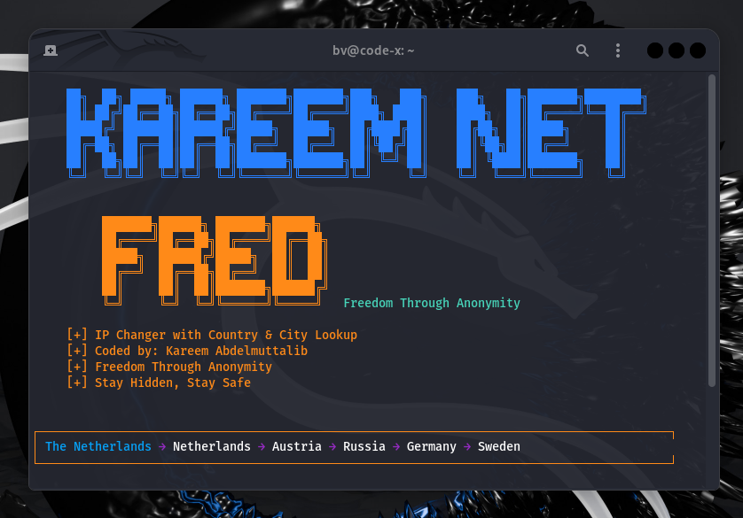

<p align="center">
  
</p>


# KAREEM NET FRED

## Overview

**KAREEM NET FRED** is a powerful command-line tool designed to help users maintain anonymity and enhance their digital privacy by automatically changing both their IP address via the Tor network and their MAC address. It is especially useful for security researchers, journalists, activists, and privacy-conscious individuals operating in sensitive environments.

---

## Key Features

- Automatically change your IP address through the Tor network  
- Change MAC address randomly or set a specific one  
- Option to enable or disable MAC address changing  
- Send real-time notifications to a Telegram bot  
- Log all IP and MAC changes locally in a structured format  
- Display geolocation details (country and city) for each new IP address  
- Easy-to-use interactive terminal interface  
- Dark web resource access links provided (requires Tor)  

---

## Who Is This Tool For?

This tool is intended for:

- Cybersecurity professionals and penetration testers  
- Journalists and whistleblowers who need to stay anonymous  
- Activists and researchers working under surveillance-heavy conditions  
- Anyone concerned about digital privacy and online tracking  

---

## How It Works

- **Tor Integration**: The tool connects to the Tor service and sends a signal to request a new identity (new circuit), which results in a new external IP address.  
- **MAC Address Spoofing**: Uses standard Linux commands (`ifconfig`, `ip`, or `macchanger`) to reset and spoof the MAC address.  
- **Geolocation Lookup**: Retrieves the country and city for both the old and new IP addresses.  
- **Telegram Notifications**: Sends a Telegram message with full details after each IP/MAC change.  
- **Logging**: Saves all changes in a structured JSON log file with timestamp, IP, location, and MAC info.  

---

## Usage Instructions

### Run the Script

Ensure the script is executable and run it using Python 3:

```bash

python3 kareem_net_fred.py
```

### Configure Tor Ports

You can change the default Tor ports used by the tool for better compatibility:
```bash

Control Port: 9051
SOCKS Port: 9050
```


Make sure these match the ones defined in your Tor configuration file (`/etc/tor/torrc`).
---

### Configure MAC Address Options

Choose how MAC addresses are changed:

```bash


[1] Enable random MAC changing
[2] Set a specific MAC address (manual input)
[3] Disable MAC changing
[4] Back to main menu
```


If you select option 2, enter a MAC in the format:

```bash
XX:XX:XX:XX:XX:XX
Example: 00:11:22:33:44:55

```


---

### Enable Telegram Notifications

You can connect your bot to receive IP and MAC change alerts.

You'll need:

```bash


    Your Telegram bot token

    Your Telegram chat ID
```


Test the connection before saving the config:

```bash
[*] Testing Telegram connection...

```


If successful, the bot will send you detailed updates.

---

### Enable Logging

Log every IP and MAC change to a structured `.json` file.

Example log entry:

```bash
{
"timestamp": "2025-08-03 14:32:12",
"old_ip": "185.220.101.1",
"new_ip": "185.220.102.5",
"old_country": "Germany",
"new_country": "Switzerland",
"old_mac": "00:11:22:33:44:55",
"new_mac": "66:77:88:99:AA:BB"
}
```


Default log file name:
```bash
KAREEM_NET_FRED.log
```


You can customize this in the initial setup.

---

### Loop Mode (Auto Identity Change)

You can run in continuous change mode by selecting:

```bash
[*] Enter interval in seconds (default 30):
```


Example:
```bash
[*] Enter interval in seconds (default 30): 60

This means identity (IP/MAC) will change every 60 seconds.

To stop the loop:


Ctrl + C
```
---

### Dark Web Resource Access

The tool includes a section for accessing .onion links.

Example:

```bash
http://zqktlwiuavvvqqt4ybvgvi7tyo4hjl5xgfuvpdf6otjiycgwqbym2qad.onion/wiki/index.php/Main_Page
```


> Make sure you're connected to Tor to access these links.

---

### Requirements

- Linux-based system (Debian/Ubuntu recommended)  
- Python 3  
- Tor (`sudo apt install tor`)  
- macchanger (`sudo apt install macchanger`)  
- Internet connection  
- Root privileges  

---

### Disclaimer


```bash
KAREEM NET FRED is intended for educational and ethical use only.
The developer is not responsible for any misuse of this tool.
Use responsibly and in accordance with the laws in your country.
```

<p align="center">
  
</p>

